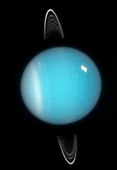

<html>
<head>
    <title>Georgie's Space Project</title>
    <link rel="stylesheet" type="text/css" href="Georgies space project style sheet.css">
</head>
<body>
    

      

        <a id="header-title" href="index.html">Georgie's Space Project</a>
        <ul id="header-nav">
          <li><a href="solarsystem.html">The Solar System</a></li>
          <li><a href="mercury.html">Mercury</a></li>
          <li><a href="venus.html">Venus</a></li>
          <li><a href="Earth.html">Earth</a></li>
          <li><a href="Mars.html">Mars</a></li>
          <li><a href="Jupiter.html">Jupiter</a></li>
          <li><a href="Saturn.html">Saturn</a></li>
          <li><a href="Uranus.html">Uranus</a></li>
          <li><a href="Neptune.html">Neptune</a></li>
          <li><a href="Pluto.html">Pluto</a></li>
        </ul>
      
 <!-- container -->
    
 <!-- header -->
    

      

        

          
28/10/18

          <h3 class="post-title">Uranus</h3>
          

            

              
          
 <!-- post-content -->
        
 <!-- post -->
      
 <!-- post-container -->
    
 <!-- content -->
    

      

        

          <h4>My Links</h4>
          

            <a href="https://www.dkfindout.com/uk/space/">DK Space</a>
             
            <a href="https://www.bbc.com/bitesize/topics/zkbbkqt">BBC Bitesize</a>
          

        
 <!-- column -->
        

          <h4>About me</h4>
          
I'm a year two student at East Boldon Infants School learning about space this term.

        
 <!-- column -->
      
 <!-- container -->
    
 <!-- footer -->
</body>
</html>
