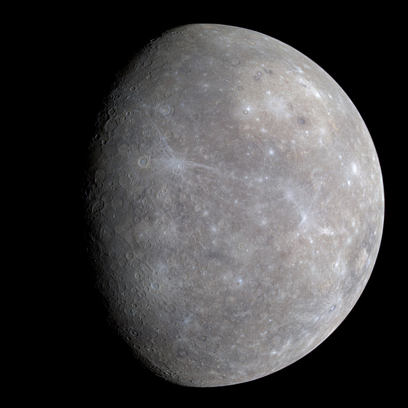
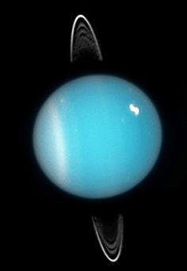

<body>
    

      

        

          

            
            Georgie Foley
          
 <!-- post-author -->
          
28/10/18

          <h3 class="post-title">The Project</h3>
          

            
This is my half term project about space.

              
          
 <!-- post-content -->
        
 <!-- post -->
      
 <!-- post-container -->
              

        

          
28/10/18

          <h3 class="post-title">The Solar System</h3>
          

            
This is my drawing of the solar system with the sun in the middle.

              
          
 <!-- post-content -->
        
 <!-- post -->
      
 <!-- post-container -->
        

        

          
10/11/18

          <h3 class="post-title">Mercury</h3>
          

            
Here is a photo of Mercury.

              
          
 <!-- post-content -->
        
 <!-- post -->
      
 <!-- post-container -->
         

        

          
10/11/18

          <h3 class="post-title">Venus</h3>
          

            
My favourite fact about Venus is that it is the second-brightest natural object in the night sky!

          
 <!-- post-content -->
        
 <!-- post -->
      
 <!-- post-container -->
         

        

          
10/11/18

          <h3 class="post-title">Earth</h3>
          

            
This is what Earth looks like from space.

              
          
 <!-- post-content -->
        
 <!-- post -->
      
 <!-- post-container -->
        

          
11/11/18

          <h3 class="post-title">Mars</h3>
          

            
I found this fact about Mars on the NASA site.

              
          
 <!-- post-content -->
        
 <!-- post -->
      
 <!-- post-container -->
     

        

          
11/11/18

          <h3 class="post-title">Jupiter</h3>
          

            
Here are some facts about Jupiter.

              
          
 <!-- post-content -->
        
 <!-- post -->
      
 <!-- post-container -->
     

        

          
11/11/18

          <h3 class="post-title">Saturn</h3>
          

            
Here is my painting of Saturn.

              
          
 <!-- post-content -->
        
 <!-- post -->
      
 <!-- post-container -->
          

        

          
11/11/18

          <h3 class="post-title">Uranus</h3>
          

            
A great picture of Uranus.

              
          
 <!-- post-content -->
        
 <!-- post -->
      
 <!-- post-container -->
    
 <!-- content -->
    

      

        

          <h4>My Links</h4>
          

            <a href="https://www.dkfindout.com/uk/space/">DK Space</a>
             
            <a href="https://www.bbc.com/bitesize/topics/zkbbkqt">BBC Bitesize</a>
          

        
 <!-- column -->
        

          <h4>About me</h4>
          
I'm a year two student at East Boldon Infants School learning about space this term.

        
 <!-- column -->
      
 <!-- container -->
    
 <!-- footer -->
</body>
